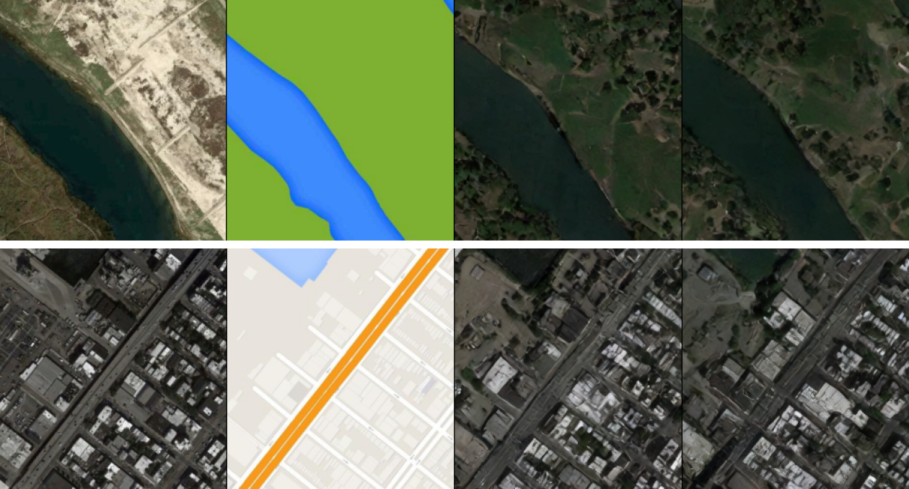

# Conditional LDM for Aerial Imagery

Check our paper *Latent Diffusion Approaches for Conditional Generation of Aerial Imagery: A Study* (2025), published at the [MLBriefs 2024](https://mlbriefs.com/) workshop of the Image Processing On Line journal ([IPOL](https://www.ipol.im/)).

This repository allows to explore a conditional latent diffusion model for the generation of aerial images from an input map.

We used the public `pix2pix-maps` dataset. Available [here](https://www.kaggle.com/datasets/alincijov/pix2pix-maps).

Based on [zyinghua/uncond-image-generation-ldm](https://github.com/zyinghua/uncond-image-generation-ldm) and [huggingface/diffusers](https://github.com/huggingface/diffusers).

If you find this code or work helpful, please cite:
```
@article{mari2025latent,
  title={Latent Diffusion Approaches for Conditional Generation of Aerial Imagery: A Study},
  author={Mar{\'\i}, Roger and Redondo, Rafael},
  journal={Image Processing On Line},
  year={2025}
}
```

---


<strong>Figure 1:</strong> Left to right: Real aerial image, conditional map input to the LDM and 2 different synthetic output samples

---

## Installation

Use the script `setup_ldm-mlbriefs24_venv.sh` to install the necessary conda environment and train the LDM on your own dataset.

```
bash setup_ldm-mlbriefs24_venv.sh
```

---

## Inference

We release the [pre-trained weights](https://huggingface.co/rogermm14/MLBriefs24_5_conditional_CA_encodedmask/tree/main) of our model.
The script `run_demo.py` can be used to run the pre-trained model. Example:

```
python3 run_demo.py --img_path example_data/206_map.jpg --time_steps 500
```
The parameter `img_path` points towards the input condition (the map image).

The parameter `time_steps` refers to the number of diffusion time steps (positive integer).

A lower number of `time_steps` results in a lower quality image synthesis, but a higher inference speed.

Set `time_steps` < 50 for low quality, < 500 for medium quality, 1000 for max quality. 

You can also check our [online demo](https://ipolcore.ipol.im/demo/clientApp/demo.html?id=77777000505).

---

## Training

The `train_maps.py` script can be use to train the diffusion model from scratch.

`MLBriefs24_run_exp.sh` runs all the experiments discussed in the paper.


